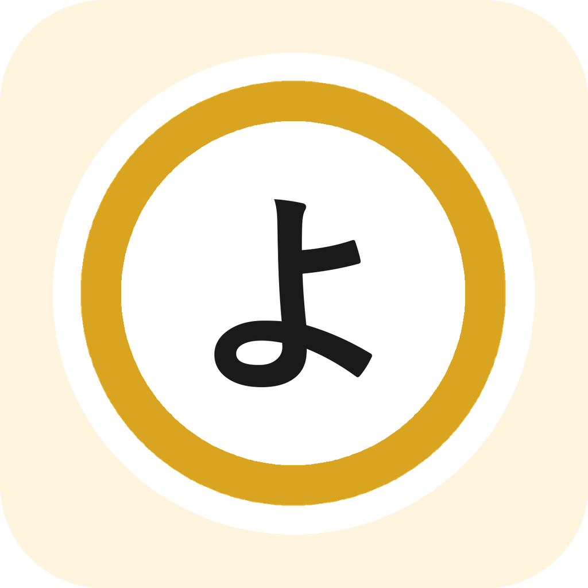

<div align="center">



# Yomikae

### Lis tes webtoons coréens en anglais, traduits sur ton téléphone

Fork de [Mihon](https://github.com/mihonapp/mihon) (lecteur de manga Android) qui traduit les pages
automatiquement, **sans serveur ni compte** : lecture du texte, traduction et réécriture dans les bulles
se font sur l'appareil.

[](/LICENSE)

</div>

## Ce que fait Yomikae

- **Traduit les chapitres téléchargés** (coréen → anglais aujourd'hui, japonais et français prévus) et affiche la page
  traduite dans le lecteur, avec un bouton pour revenir à l'original.
- **Tout en local** : OCR PaddleOCR et modèle de traduction Hy-MT2 1.8B tournent sur le téléphone (GPU). Un serveur
  sur PC reste possible en option pour les curieux.
- **Mémoire de série** : si tu as aussi l'édition anglaise officielle d'une série, l'app s'en sert comme référence
  (noms, ton, tournures) pour traduire les chapitres qu'elle n'a pas encore.
- **Fiche unifiée** : une seule fiche par œuvre même si tu l'as depuis trois sources ; chaque chapitre s'affiche dans la
  version disponible la meilleure pour ta langue de lecture (édition officielle, sinon raw traduit).
- **File de traduction** avec temps restant, ordre modifiable, traduction automatique pendant la lecture ou dès qu'un
  chapitre est téléchargé.
- Tout le reste est Mihon : sources par extensions, bibliothèque, suivi, sauvegardes.

## Installation (débutant)

**Il te faut** : un téléphone Android 8 ou plus. Pour le modèle de traduction embarqué, un téléphone récent avec au
moins 8 Go de mémoire (testé sur un Galaxy S26 Ultra). Sur un téléphone plus modeste, le moteur Google ML Kit reste
disponible (moins bon, mais léger).

1. **Télécharge l'APK** dans les [Releases](https://github.com/DelDaxter/Yomikae/releases) (fichier
   `Yomikae-…-arm64.apk`) et ouvre-le. Android te demandera d'autoriser l'installation depuis cette source : accepte.
   Yomikae s'installe à côté de Mihon sans le remplacer.
2. **Ajoute des sources.** Yomikae n'a aucune source intégrée, comme Mihon. Dans l'app : *Plus → Paramètres →
   Explorer → Dépôts d'extensions*, ajoute :
   - `https://raw.githubusercontent.com/keiyoushi/extensions/repo/index.min.json` (sources anglaises, dont Webtoons.com) ;
   - `https://raw.githubusercontent.com/oneulddu/Korean-Mihon-Extensions/repo/index.min.json` (sources coréennes,
     dont Naver Webtoon).

   Puis *Explorer → Extensions* et installe celles que tu veux (par exemple **Naver Webtoon** pour les raws coréens
   officiels et **Webtoons.com** pour l'anglais officiel). Sur Naver, cherche les titres en coréen.
3. **Prépare la traduction** : *Plus → Paramètres → Traduction*.
   - *Langue d'origine* : coréen. *Langue cible* : anglais.
   - *Moteur de traduction* : **Sur cet appareil**. Dans *Modèle embarqué*, appuie sur le modèle pour le télécharger
     (1,8 Go, une seule fois, en Wi-Fi).
   - *Lecture du texte (OCR)* : PaddleOCR (18 Mo, téléchargés au premier usage).
4. **Traduis un chapitre** : télécharge un chapitre coréen (icône ⬇ sur sa ligne), puis appuie sur l'icône de
   traduction 文A qui apparaît à côté. Suis l'avancement dans *Plus → File de traduction*. Ouvre le chapitre : il est
   traduit. Compte 3 à 4 secondes par page sur un téléphone récent.

### Pour aller plus loin

- **Traduire pendant la lecture** (activé par défaut) : ouvrir un chapitre téléchargé lance sa traduction en tête de
  file et prépare le suivant.
- **Traduire les nouveaux téléchargements** : réglage global dans *Traduction*, ou série par série (fiche → ⋮ →
  *Traduction automatique…*).
- **Fiche unifiée** : depuis la fiche à garder, ⋮ → *Fiche unifiée…*, coche les autres fiches de la même œuvre.
  Le titre, le synopsis et les chapitres passent dans ta langue de lecture quand une édition l'a.
- **Mémoire de série** : fiche → ⋮ → *Mémoire de série* : choisis l'édition traduite de référence, *Lire le texte de la
  référence*, puis *Apparier les bulles*. Si les numéros de chapitres ne concordent pas entre les éditions (prologue
  compté « 1 » d'un côté), *Détecter* trouve le décalage.
- **Glossaires** : un glossaire global (termes de genre, noblesse, formes d'adresse) est fourni et modifiable dans
  *Traduction → Glossaire global* ; chaque série a le sien dans sa mémoire de série.

## Compiler soi-même

JDK 21 et le SDK Android (API 36). Dans `local.properties`, `sdk.dir` doit utiliser des barres obliques
(`S:/Android/Sdk` sur Windows). Puis :

```
./gradlew :app:assembleDebug
```

L'APK est dans `app/build/outputs/apk/debug/`. L'app de debug s'appelle `app.yomikae.dev` et cohabite avec la
version normale.

## Licences

Yomikae est sous Apache-2.0, comme Mihon. Les briques ajoutées sont toutes sous licences permissives : PaddleOCR
(Apache-2.0), ONNX Runtime (MIT), LiteRT-LM (Apache-2.0), modèle Hy-MT2 de Tencent (Apache-2.0), post-traitement
DBNet adapté de [overlay-translator](https://github.com/ciddwd/overlay-translator) (Apache-2.0). Google ML Kit reste
disponible comme moteur léger (bibliothèque propriétaire de Google, non requise).

Les modèles ne sont pas dans l'APK : ils sont téléchargés à la première utilisation et vérifiés (SHA-256).

## Crédits

[Mihon](https://github.com/mihonapp/mihon) et ses contributeurs ; [Keiyoushi](https://github.com/keiyoushi/extensions)
et [Korean Mihon Extensions](https://github.com/oneulddu/Korean-Mihon-Extensions) pour les sources ;
[Tencent Hunyuan](https://huggingface.co/tencent/Hy-MT2-1.8B) et la
[communauté LiteRT](https://huggingface.co/litert-community/Hy-MT2-1.8B) pour le modèle de traduction ;
[PaddlePaddle](https://github.com/PaddlePaddle/PaddleOCR) pour l'OCR.
