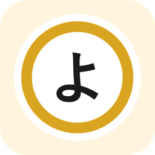

# Yomikae

### Lis tes webtoons coréens en anglais, traduits sur ton téléphone

Lecteur de manga et de webtoons pour Android qui traduit les pages automatiquement, **sans serveur ni
compte** : lecture du texte, traduction et réécriture dans les bulles se font sur l'appareil.

## Ce que fait Yomikae

- **Traduit les chapitres téléchargés** (coréen → anglais ou français ; japonais prévu) et affiche la page
  traduite dans le lecteur, avec un bouton pour revenir à l'original.
- **Tout en local** : OCR PaddleOCR et modèle de traduction Hy-MT2 1.8B tournent sur le téléphone (GPU). Un serveur
  sur PC reste possible en option pour les curieux.
- **Mémoire de série** : si tu as aussi l'édition anglaise officielle d'une série, l'app s'en sert comme référence
  (noms, ton, tournures) pour traduire les chapitres qu'elle n'a pas encore.
- **Fiche unifiée** : une seule fiche par œuvre même si tu l'as depuis trois sources ; chaque chapitre s'affiche dans la
  version disponible la meilleure pour ta langue de lecture (édition officielle, sinon raw traduit).
- **File de traduction** avec temps restant, ordre modifiable, traduction automatique pendant la lecture ou dès qu'un
  chapitre est téléchargé.
- Et tout ce qu'on attend d'un lecteur : sources par extensions, bibliothèque, suivi, sauvegardes.

## Installation (débutant)

**Il te faut** : un téléphone Android 8 ou plus. Pour le modèle de traduction embarqué, un téléphone récent avec au
moins 8 Go de mémoire (testé sur un Galaxy S26 Ultra). Sur un téléphone plus modeste, le moteur Google ML Kit reste
disponible (moins bon, mais léger).

1. **Télécharge l'APK** dans la [dernière release](https://github.com/DelDaxter/Yomikae/releases/latest) : le
   fichier **`Yomikae-vX.Y.Z-arm64-v8a.apk`** (téléphones et tablettes Android, le bon dans 99 % des cas ; l'autre fichier,
   « autres appareils », ne sert que pour un Chromebook ou un émulateur). Ouvre-le sur le téléphone. Android te demandera d'autoriser l'installation depuis cette source : accepte.
   Yomikae s'installe à côté de tes autres lecteurs sans les remplacer.
2. **Installe des sources.** Les dépôts d'extensions sont déjà enregistrés au premier lancement : va dans
   *Explorer → Extensions* et installe celles que tu veux, par exemple **Naver Webtoon** pour les raws coréens
   officiels et **Webtoons.com** pour l'anglais officiel. Sur Naver, cherche les titres en coréen.
3. **Prépare la traduction** : *Plus → Paramètres → Traduction*.
   - *Langue d'origine* : coréen. *Langue cible* : anglais.
   - *Moteur de traduction* : **Sur cet appareil**. Dans *Modèle embarqué*, appuie sur le modèle pour le télécharger
     (1,8 Go, une seule fois, en Wi-Fi).
   - *Lecture du texte (OCR)* : PaddleOCR, déjà dans l'APK, rien à télécharger.
4. **Traduis un chapitre** : télécharge un chapitre coréen (icône ⬇ sur sa ligne), puis appuie sur l'icône de
   traduction 文A qui apparaît à côté. Suis l'avancement dans *Plus → File de traduction*. Ouvre le chapitre : il est
   traduit. Compte 3 à 4 secondes par page sur un téléphone récent.

### Pour aller plus loin

- **Traduire pendant la lecture** (activé par défaut) : ouvrir un chapitre téléchargé lance sa traduction en tête de
  file et prépare le suivant.
- **Traduire les nouveaux téléchargements** : réglage global dans *Traduction*, ou série par série (fiche → ⋮ →
  *Traduction automatique…*).
- **Fiche unifiée** : depuis la fiche à garder, ⋮ → *Fiche unifiée…*, coche les autres fiches de la même œuvre.
  Le titre, le synopsis et les chapitres passent dans ta langue de lecture quand une édition l'a.
- **Mémoire de série** : fiche → ⋮ → *Mémoire de série* : choisis l'édition traduite de référence, *Lire le texte de la
  référence*, puis *Apparier les bulles*. Si les numéros de chapitres ne concordent pas entre les éditions (prologue
  compté « 1 » d'un côté), *Détecter* trouve le décalage.
- **Glossaires** : un glossaire global (termes de genre, noblesse, formes d'adresse) est fourni et modifiable dans
  *Traduction → Glossaire global* ; chaque série a le sien dans sa mémoire de série.

## Mises à jour

Chaque version est construite et signée automatiquement sur GitHub (dossier *Releases*). L'app te prévient quand une
nouvelle version est disponible et l'installe par-dessus l'ancienne, sans rien perdre.

## Pour les développeurs

JDK 21 et SDK Android (API 36), puis `./gradlew :app:assembleDebug`. L'app de debug (`app.yomikae.dev`) cohabite
avec la version normale.

## Licences

Yomikae est sous licence Apache-2.0. Les briques de traduction sont toutes sous licences permissives : PaddleOCR
(Apache-2.0), ONNX Runtime (MIT), LiteRT-LM (Apache-2.0), modèle Hy-MT2 (Apache-2.0). Google ML Kit reste disponible
comme moteur léger (bibliothèque propriétaire de Google, non requise).

La lecture du texte (PaddleOCR, 18 Mo) est dans l'APK. Le modèle de traduction (1,8 Go) n'y est pas : il est téléchargé une fois, à la demande, et vérifié (SHA-256).

## Remerciements

Merci à tous les projets open source dont Yomikae s'inspire et sur lesquels il s'appuie : lecteur, extensions,
modèles d'OCR et de traduction, et leurs communautés.
